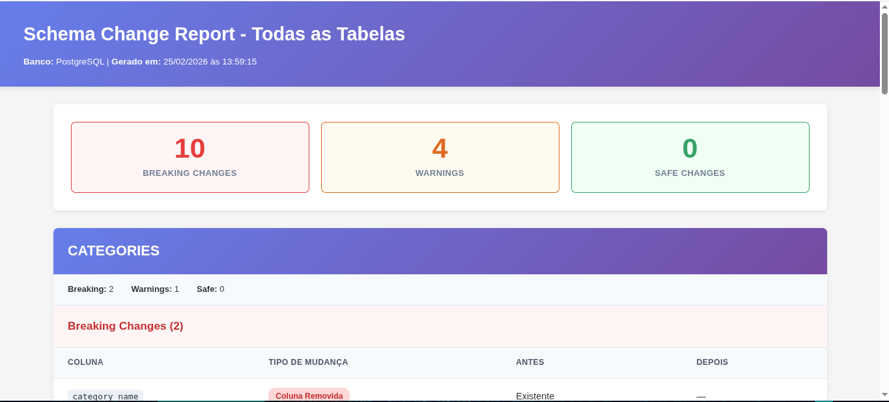

## Schema Change Detector
Sistema para detectar e classificar mudanças em schemas PostgreSQL, gerando relatórios HTML e no Terminal.


### Sobre o Projeto

Desenvolvi esta ferramenta para automatizar a detecção de mudanças em schemas PostgreSQL. O sistema captura snapshots dos metadados, compara versões diferentes e classifica as mudanças por impacto (breaking, warning ou safe), gerando relatórios HTML consolidados.

**Origem do projeto:**

Trabalhei numa migração SQLite → PostgreSQL → SQLite de um sistema interno no SAME do HCE. A complexidade de rastrear 
mudanças manualmente me levou a criar um script para extrair metadados em JSON e comparar versões.

O script evoluiu para este sistema completo de detecção e classificação.

## Como Funciona

O sistema opera em 4 etapas:

### 1. Extração de Metadados

O exportador conecta no PostgreSQL e extrai:
- Nome das colunas
- Tipos de dados
- Constraints (NOT NULL, UNIQUE, PK, FK)
- Valores default

Output: Arquivos JSON em `historico/`

### 2. Comparação de Snapshots

O comparador identifica 3 tipos de mudanças:
- Colunas adicionadas
- Colunas removidas  
- Propriedades modificadas

### 3. Classificação de Impacto

Cada mudança recebe um rótulo:

**BREAKING** (quebra compatibilidade):
- Coluna removida
- Tipo alterado
- NOT NULL adicionado

**WARNING** (atenção):
- NOT NULL removido
- FK adicionada
- UNIQUE modificada

**SAFE** (compatível):
- Coluna nullable adicionada

### 4. Geração de Relatório

Relatório HTML consolidado com:
- Resumo geral (total por categoria)
- Detalhes por tabela

**Relatório HTML (exemplo):**   


---
**Estrutura do Projeto:**  

    Schema-Change-Detector/
    ├── fonte/
    │   ├── exportador.py  # Extração de metadados do PostgreSQL
    │   ├── comparador.py  # Detecta e classifica mudanças
    │   └── relatorio.py  # Gera relatórios HTML
    ├── historico/  # Snapshots JSON das tabelas
    ├── relatorios/
    ├── templates/  # Templates do relatório versão HTML
    │   ├── base.html
    │   ├── secao_breaking.html
    │   ├── secao_safe.html
    │   ├── secao_warning.html
    │   └── tabela.html
    ├── .env  # Credenciais do banco para o exportador.py
    ├── requirements.txt
    └── README.md

### Como Usar
---
**Gerar snapshot inicial (antes das mudanças):**  

    bashpython3 fonte/exportador.py  

Isso cria arquivos `*_em_execucao.json` no diretório historico/ com o estado atual de cada tabela.   

**Fazer alterações no banco de dados:**   
Aplique suas migrations, alterações de schema, ou qualquer mudança estrutural.   

**Gerar novo snapshot e comparar:**   
O exportador renomeia automaticamente os arquivos antigos      
```
# para *_para_analise.json e cria novos *_em_execucao.json
python3 fonte/exportador.py

# Comparar e gerar relatório
python3 fonte/comparador.py
```

O sistema processa todas as tabelas, exibe um resumo no terminal e gera um relatório HTML consolidado em `relatorios/relatorio_consolidado_YYYY-MM-DD_HH-MM-SS.html`.

## Exemplos de Output

**Terminal:**
```
(venv) ┌─[✗]─[yuri@parrot]─[~/Desktop/Projetos/Schema-Change-Detector]
└──╼ $python3 fonte/comparador.py
Iniciando verificacao em: historico

Tabela CATEGORIES

MUDANÇAS DETECTADAS:
Adicionadas: 0 | Removidas: 1 | Modificadas: 2
 • category_name: BREAKING - Coluna removida
 • category_id (BREAKING: NOT NULL adicionado): not_null de False para True
 • category_id (WARNING: Constraint UNIQUE mudou): unique de False para True
Tabela CLIENTES_TESTE

MUDANÇAS DETECTADAS:
Adicionadas: 0 | Removidas: 0 | Modificadas: 4
 • id_teste (BREAKING: NOT NULL adicionado): not_null de False para True
 • nome_teste (WARNING: NOT NULL removido): not_null de True para False
 • nome_teste (BREAKING: PRIMARY KEY mudou): primary_key de False para True
 • nome_teste (WARNING: Constraint UNIQUE mudou): unique de False para True
Tabela CUSTOMERS

MUDANÇAS DETECTADAS:
Adicionadas: 0 | Removidas: 2 | Modificadas: 0
 • customer_email: BREAKING - Coluna removida
 • customer_lname: BREAKING - Coluna removida
Tabela DEPARTMENTS

MUDANÇAS DETECTADAS:
Adicionadas: 0 | Removidas: 1 | Modificadas: 1
 • department_name: BREAKING - Coluna removida
 • department_id (WARNING: NOT NULL removido): not_null de True para False
Tabela ORDER_DETAIL_V

MUDANÇAS DETECTADAS:
Adicionadas: 0 | Removidas: 1 | Modificadas: 2
 • order_customer_id: BREAKING - Coluna removida
 • order_date (BREAKING: NOT NULL adicionado): not_null de False para True
 • order_date (BREAKING: PRIMARY KEY mudou): primary_key de False para True
Tabela ORDER_ITEMS

MUDANÇAS DETECTADAS:
Adicionadas: 0 | Removidas: 0 | Modificadas: 0
Tabela ORDERS

MUDANÇAS DETECTADAS:
Adicionadas: 0 | Removidas: 0 | Modificadas: 0
Tabela PRODUCTS

MUDANÇAS DETECTADAS:
Adicionadas: 0 | Removidas: 0 | Modificadas: 0

Relatório HTML Consolidado: relatorios/relatorio_consolidado_2026-02-25_13-59-15.html
```

*Relatório consolidado mostrando todas as tabelas, classificação 
por severidade e detalhes de cada mudança.*

## Stack Técnica

**Backend:**  
- SQLAlchemy (ORM e reflection)   
- psycopg2 (driver PostgreSQL)  
- python-dotenv (variáveis de ambiente)

**Frontend:**  
- HTML/CSS  

**Arquitetura:**
- 3 módulos independentes (extrator, comparador, reporter)
- Separação de responsabilidades
- JSON como formato intermediário
- Templates HTML separados

**Formato de dados:**
- Snapshots em JSON
- Versionamento via timestamp
- Nomenclatura: `{tabela}_{tipo}.json`   

## Limitações Atuais

**Ordem das colunas:**  
Não detecta reordenação de colunas (ex: coluna A que era a primeira agora é a terceira). Isso raramente importa, mas pode afetar queries que usam SELECT *.  

**Schemas múltiplos:**  
Assume que todas as tabelas estão no schema public. Se você usa múltiplos schemas, precisa adaptar o código do exportador.

## Casos de Uso

**Revisão de Migrations:**  
Antes de aplicar migração, gero um snapshot do ambiente de staging, aplico a migração, gero outro snapshot e analiso o relatório. Se aparecer algum breaking change inesperado, sei que preciso ajustar o código da aplicação antes do deploy.

**Documentação de Mudanças:**  
Os relatórios HTML servem como documentação histórica. Arquivamos junto com as migrations no Git, então qualquer pessoa do time pode entender exatamente o que mudou em cada release.  

**Detecção de Drift:**  
Comparando snapshots de produção vs desenvolvimento, consigo identificar quando alguém fez uma alteração manual no banco que não está nas migrations. Para novos desenvolvedores, mostra o histórico de relatórios para explicar como o schema evoluiu. É muito mais fácil que ler 50 arquivos de migration.

## Contribuindo

Se você encontrar bugs ou tiver sugestões, fique à vontade para abrir uma issue ou pull request. O código está organizado de forma modular justamente para facilitar contribuições.  

## Licença
***MIT License*** - use como quiser, modifique, distribua. Se for útil pra você, fico feliz.

## Autor
Yuri Pontes,  
Cabo do Exército Brasileiro, em transição para engenharia de dados, com foco em Python, SQL e automação de processos.

**LinkedIn:** [Yuri Pontes](https://www.linkedin.com/in/yuri-pontes-4ba24a345/)  
**GitHub:** [yurivski](https://github.com/yurivski)

---
Este projeto nasceu de uma necessidade real no trabalho e foi desenvolvido nas horas vagas.